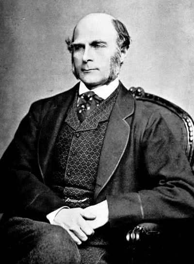
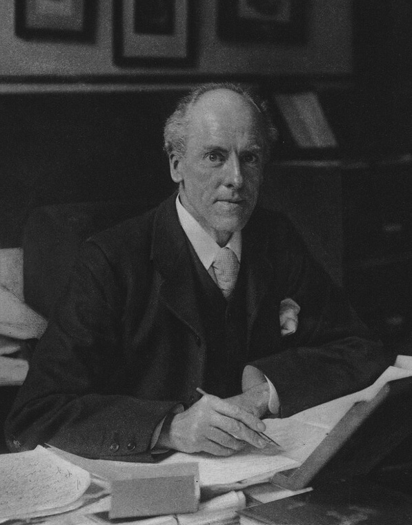
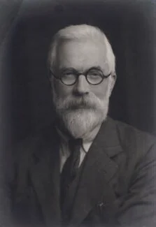
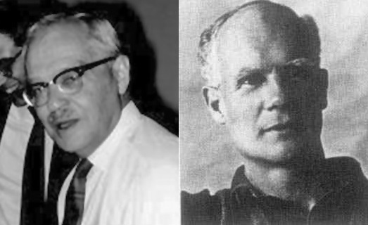
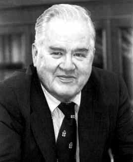
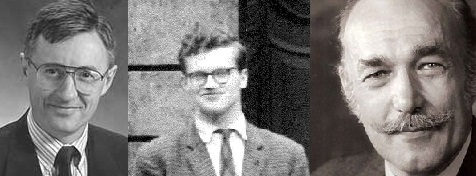

# Introdução e Panorama dos Modelos de Regressão

Este livro é dedicado aos estudos de **Modelos de Regressão**, desde a formulação clássica até extensões modernas. O material apoia as disciplinas Modelos de Regressão I (CC0290) e Modelagem Estatística (CC0452), ambas com implementação no software R. Ao longo do semestre, o estudante terá contato tanto com a fundamentação matemática e estatística quanto com aplicações práticas em diferentes áreas, utilizando ferramentas computacionais para explorar dados reais.

O curso está estruturado de forma progressiva: parte-se da regressão linear simples, como porta de entrada ao raciocínio de modelagem, avança-se para a regressão linear múltipla, inclusão de variáveis categóricas e técnicas de seleção de variáveis e análise de diagnóstico. Tópicos adicionais como modelos lineares generalizados (MLGs), extensões não lineares e métodos de regularização também serão apresentados.

Mais do que aprender procedimentos técnicos, o objetivo é desenvolver a capacidade de interpretar resultados, avaliar a adequação dos modelos e comunicar conclusões de forma clara. A ênfase está tanto na teoria quanto na prática, de modo que o estudante seja capaz de aplicar a modelagem estatística em contextos multidisciplinares.

## A centralidade da regressão

A análise de regressão ocupa posição central na Estatística e, em especial, na Econometria. Como afirma @hoffmann2016:

> "A análise de regressão é o método mais importante da econometria."

Essa afirmação reflete o fato de que praticamente toda modelagem econométrica, seja para estimar elasticidades, avaliar políticas públicas, medir impactos ou testar teorias, passa, de alguma forma, por um modelo de regressão.

Mas essa centralidade não é exclusiva da economia. Na saúde, a regressão mede risco e associações; na engenharia, modela desempenho; nas ciências ambientais, estima impactos; nas ciências sociais, investiga relações estruturais; na ciência de dados, permanece como ferramenta interpretável diante de modelos mais complexos.

A regressão tornou-se, portanto, uma linguagem universal para responder a uma pergunta fundamental:

> Como varia uma quantidade quando outra varia?

Essa pergunta é simples. A resposta exige matemática, probabilidade, inferência e interpretação.

## Objetivos do livro

-   Contextualizar historicamente os modelos de regressão;\
-   Compreender a lógica da modelagem estatística: componente sistemático, componente aleatório e relação entre estes;\
-   Apresentar e discutir os principais modelos abordados na disciplina;\
-   Conectar a teoria com aplicações em economia, saúde, engenharia, ciências sociais e ambientais;\
-   Discutir potenciais e limitações de cada abordagem, reconhecendo as hipóteses subjacentes;\
-   Desenvolver a capacidade de usar ferramentas computacionais para ajuste, diagnóstico e interpretação de modelos.

Este material é concebidao como uma jornada pela família dos modelos de regressão. Partimos de um problema simples, como relacionar uma variável resposta a uma variável explicativa, e avançamos gradualmente até modelos capazes de lidar com múltiplos fatores, variáveis categóricas, dados de contagem, proporções e situações em que as hipóteses clássicas do modelo deixam de ser válidas.

A ideia central é que, ao final do semestre, o estudante seja capaz de compreender não apenas **como ajustar** um modelo, mas também **quando e por que** usá-lo, avaliando sua adequação e reconhecendo seus limites.

## Breve História da Regressão

A regressão, como hoje a entendemos, não surgiu como uma teoria pronta nem como um capítulo isolado da Estatística. Ela é resultado de um processo histórico longo, no qual problemas práticos de mensuração, questões científicas sobre relações entre variáveis e desenvolvimentos matemáticos em teoria dos erros foram progressivamente convergindo. Sua consolidação exigiu mais de um século de elaboração conceitual e técnica.

Embora o termo “regressão” tenha sido introduzido apenas na segunda metade do século XIX, os fundamentos matemáticos que tornariam possível sua formalização remontam ao início do século XIX. A regressão nasce da interseção de três necessidades intelectuais: **(i)** resumir relações empíricas entre grandezas observáveis, **(ii)** estabelecer critérios objetivos para ajustar modelos a dados imperfeitos e **(iii)** desenvolver uma estrutura probabilística que permitisse quantificar a incerteza associada a esses ajustes.

Essa história começa antes da biologia e antes da hereditariedade. Ela começa na astronomia e na geodésia.

### Antes do nome “regressão”: o ajuste por mínimos quadrados (1805–1809)

No final do século XVIII e início do século XIX, astrônomos enfrentavam um problema técnico crucial: diferentes observações de um mesmo fenômeno, por exemplo, a posição de um planeta, produziam valores ligeiramente discrepantes. A questão não era apenas calcular uma média, mas determinar qual conjunto de parâmetros melhor explicava um sistema de observações inconsistentes.

Em 1805, Adrien-Marie Legendre publica formalmente o método dos mínimos quadrados em *Nouvelles méthodes pour la détermination des orbites des comètes*, propondo escolher os parâmetros que minimizam a soma dos quadrados dos resíduos [@legendre1805]. A escolha da soma de quadrados produzia um sistema de equações lineares tratável analiticamente e possuía propriedades geométricas que tornavam o procedimento matematicamente consistente.

Em 1809, Carl Friedrich Gauss publica *Theoria motus corporum coelestium*, no qual também utiliza o método e afirma empregá-lo desde 1795 [@gauss1809]. Gauss relaciona o método à teoria dos erros e mostra que, sob hipóteses específicas de distribuição Normal para os erros, o estimador de mínimos quadrados coincide com o estimador de máxima verossimilhança. A reconstrução histórica desse desenvolvimento e da controvérsia de prioridade entre Legendre e Gauss é analisada detalhadamente em @plackett1972, @stigler1981 e @stigler1986.

O debate sobre prioridade é parte constitutiva da história da Estatística. Mais importante do que a controvérsia é o fato de que, nesse período, o ajuste por mínimos quadrados passa a ser entendido como princípio sistemático para extrair estrutura de dados imperfeitos.

Esse desenvolvimento foi decisivo. Quando, décadas depois, cientistas começaram a investigar relações entre características observáveis, como estatura, peso, rendimento agrícola ou desempenho fisiológico, já existia um método matemático capaz de ajustar uma linha média a um conjunto de pontos. O que ainda faltava era interpretar essa linha como descrição de uma relação entre variáveis.

É nesse ponto que a história muda de domínio: da mecânica celeste para a variabilidade biológica e social.

### Francis Galton (1822–1911): regressão à mediocridade como padrão empírico (1886)

{width="35%"}

Em 1886, Francis Galton publica dois trabalhos fundamentais sobre estatura e semelhança familiar [@galton1886a; @galton1886b]. Ao comparar alturas de pais e filhos, identifica um padrão estatístico sistemático: descendentes de pais muito altos tendem, em média, a apresentar estaturas menos extremas; descendentes de pais muito baixos tendem, igualmente em média, a aproximar-se da média populacional.

Galton denominou esse fenômeno *regression toward mediocrity*. O termo “mediocridade” referia-se à média estatística da população. O que estava sendo descrito era uma propriedade da associação imperfeita entre variáveis: quando a correlação é menor que um, valores extremos tendem a ser seguidos por valores menos extremos.

Galton utilizou representações gráficas e procedimentos geométricos para estimar a tendência média. Não formulou, contudo, um procedimento geral de estimação com propriedades probabilísticas explicitadas nem apresentou uma teoria formal da regressão linear no sentido moderno. A formalização matemática rigorosa viria na geração seguinte.

### Karl Pearson (1857–1936): formalização matemática da regressão

{width="35%"}

Karl Pearson transforma a intuição de Galton em estrutura matemática sistemática. Em 1896, apresenta a formulação analítica da regressão linear simples e explicita sua relação com a covariância e a variância. A inclinação da reta de regressão passa a ser expressa como razão entre covariância e variância, estabelecendo formalmente a conexão entre regressão e correlação.

Em 1903, Pearson e Alice Lee ampliam essa abordagem no estudo das leis de herança [@pearson1903], consolidando o uso da regressão como instrumento quantitativo no programa biométrico.

Em 1901, juntamente com W. F. R. Weldon e com apoio de Galton, funda a revista *Biometrika*, central na institucionalização da Estatística como disciplina científica.

### Udny Yule (1871–1951): regressão múltipla e ampliação do escopo aplicado

{width="35%"}

Udny Yule contribuiu decisivamente para a sistematização da regressão múltipla e da correlação parcial [@yule1897; @yule1907]. Seus trabalhos ampliaram o uso das equações normais para contextos envolvendo múltiplas variáveis explicativas, favorecendo aplicações em demografia e ciências sociais.

A regressão deixa de ser instrumento predominantemente biométrico e passa a integrar um conjunto mais amplo de métodos quantitativos aplicáveis a diversas áreas empíricas.

### Ronald A. Fisher (1890–1962): integração com inferência e planejamento experimental

{width="35%"}

Ronald A. Fisher não cria a regressão linear, mas redefine seu estatuto científico ao integrá-la explicitamente ao arcabouço inferencial moderno. Em *Statistical Methods for Research Workers* (1925) [@fisher1925], sistematiza procedimentos de teste aplicáveis a modelos lineares. Em *The Design of Experiments* (1935) [@fisher1935], estabelece princípios de randomização e planejamento experimental que estruturam a interpretação causal.

A decomposição da variabilidade já estava implícita na teoria dos mínimos quadrados. O mérito de Fisher foi sistematizar essa decomposição no contexto da análise de variância e integrá-la a um sistema coerente de inferência. A regressão passa a ser entendida como modelo probabilístico com hipóteses explícitas sobre estrutura de erro e distribuição.

### Jerzy Neyman (1894–1981) e Egon S. Pearson (1895–1980): estrutura formal da decisão estatística

{width="55%"}

Em 1933, Neyman e Egon Pearson estabelecem a teoria formal dos testes de hipóteses [@neymanpearson1933], definindo erros do tipo I e tipo II e critérios baseados em propriedades de longo prazo. Embora sua contribuição não seja específica da regressão, ela molda profundamente sua prática.

A partir desse arcabouço, estimativas em modelos lineares passam a ser acompanhadas por testes com propriedades explicitamente definidas. Posteriormente, Neyman introduz a formulação moderna de intervalos de confiança [@neyman1937], completando a estrutura inferencial que passa a integrar naturalmente a análise de regressão.

### John W. Tukey (1915–2000): análise exploratória e diagnóstico

{width="40%"}

Técnicas de inspeção de resíduos já eram conhecidas, mas John Tukey sistematiza a análise exploratória como etapa metodológica autônoma. Em *Exploratory Data Analysis* (1977) [@tukey1977], defende a distinção entre análise exploratória e confirmatória.

No contexto da regressão, isso implica examinar resíduos, identificar não linearidades, heterocedasticidade e pontos influentes como parte integrante da modelagem. O diagnóstico deixa de ser etapa auxiliar e passa a constituir componente essencial do processo estatístico.

### Nelder, Wedderburn, McCullagh: generalização estrutural da regressão

{width="55%"}

Em 1972, Nelder e Wedderburn introduzem os Modelos Lineares Generalizados, ampliando a regressão para distribuições da família exponencial e funções de ligação apropriadas [@nelderwedderburn1972]. Em 1983, McCullagh e Nelder sistematizam essa teoria em *Generalized Linear Models* [@mccullaghnelder1989].

A estrutura central permanece a modelagem da média condicional, mas o arcabouço probabilístico torna-se mais geral.

### Regularização e expansão computacional

Em 1970, Hoerl e Kennard propõem a ridge regression como solução para problemas de colinearidade e instabilidade numérica em sistemas não ortogonais [@hoerlkennard1970]. O objetivo original não era a alta dimensionalidade no sentido contemporâneo, mas a redução da variância do estimador sob multicolinearidade.

Em 1996, Tibshirani introduz o LASSO [@tibshirani1996], incorporando penalização $\ell_1$ e seleção automática de variáveis, ampliando o alcance da regressão para cenários com grande número de preditores.

### Contexto histórico e responsabilidade

Parte do desenvolvimento inicial da biometria esteve associada a ideias eugenistas. Galton cunhou o termo “eugenia” em 1883. Pearson e Fisher expressaram posições alinhadas a esse movimento em determinados momentos históricos.

O reconhecimento desse contexto é necessário para compreender o ambiente intelectual no qual a Estatística se institucionalizou. O método estatístico, entretanto, não é intrinsecamente vinculado a tais agendas. Sua aplicação exige responsabilidade ética e consciência histórica.

## Consolidação como pilar da Estatística moderna

A regressão consolidou-se por sucessivas ampliações conceituais:

1. Ajuste sistemático sob erro observacional;  
2. Identificação empírica da relação média condicional;  
3. Formalização matemática e desenvolvimento da regressão múltipla;  
4. Inserção no arcabouço inferencial;  
5. Consolidação do diagnóstico e da análise exploratória;  
6. Generalização probabilística;  
7. Regularização e expansão computacional.

Apesar das transformações metodológicas profundas, permanece a mesma questão fundamental:

> Qual é a estrutura da relação média entre uma variável resposta e seus preditores, e como quantificar a incerteza associada a essa descrição?

## Panorama dos Modelos de Regressão

Tendo em mente os objetivos, estruturas e suposições discutidos anteriormente, é possível visualizar o **panorama dos modelos de regressão** que compõem esta disciplina. A ideia é seguir uma trajetória progressiva: partir de modelos simples e intuitivos, que permitem enxergar diretamente a relação entre duas variáveis, e avançar gradualmente para estruturas mais sofisticadas, capazes de lidar com múltiplos fatores, respostas não normais e bases de dados complexas.

O percurso do curso está organizado em quatro blocos principais:

1.  **Fundamentos** --- regressão linear simples (MRLS), que introduz a lógica de média condicional, estimação por mínimos quadrados e análise de resíduos.\
2.  **Modelos com múltiplos fatores** --- regressão linear múltipla (MRLM), inclusão de variáveis categóricas e interpretação de efeitos parciais.\
3.  **Validação e escolha de modelos** --- métodos de diagnóstico, análise de resíduos, critérios de seleção de variáveis e regularização.\
4.  **Extensões** --- modelos lineares generalizados (GLMs), regressão polinomial, modelos não lineares e métodos modernos de regularização (Ridge e LASSO), fundamentais na era dos grandes volumes de dados.

Em cada etapa, o modelo será apresentado de forma integrada: sua **fundamentação teórica**, as **suposições** que o tornam válido, exemplos de **interpretação prática** e **aplicações reais** em áreas como economia, saúde, engenharia, ciências ambientais e ciência de dados.

Assim, o panorama da disciplina funciona como um **mapa de navegação**: consolidamos primeiro os alicerces da regressão, depois exploramos aplicações mais complexas e, por fim, avançamos até modelos modernos que dialogam diretamente com os desafios atuais da análise de dados.
