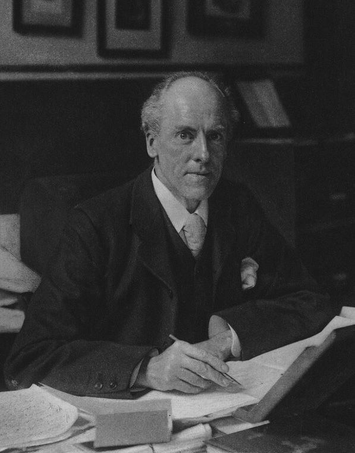
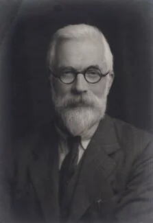
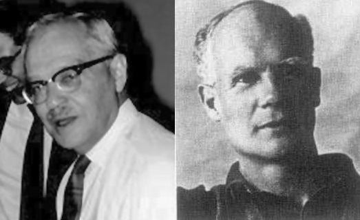
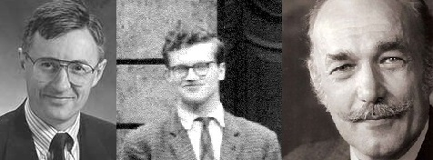

# Introdução e Panorama dos Modelos de Regressão

Este livro apresenta os modelos de regressão como instrumentos para compreender relações entre variáveis, explicar fenômenos, realizar previsões e apoiar tomadas de decisão baseadas em dados. Ao longo dos capítulos, a regressão é tratada como parte de um processo de modelagem estatística que envolve a formulação do problema, a especificação do modelo, a estimação dos parâmetros, a avaliação das hipóteses adotadas e a interpretação dos resultados. A abordagem combina fundamentos matemáticos e estatísticos com aplicações em diferentes áreas e implementação computacional no software R.

O conteúdo é desenvolvido de forma progressiva. Inicialmente, é apresentado o modelo de regressão linear simples, que permite introduzir os principais conceitos de modelagem estatística. Em seguida, são estudados modelos com múltiplas variáveis explicativas, variáveis categóricas, técnicas de diagnóstico, seleção de modelos e outros temas que ampliam o campo de aplicação da regressão. Ao final, são discutidas extensões como modelos lineares generalizados, modelos não lineares e métodos de regularização.

O objetivo é desenvolver a capacidade de interpretar resultados, avaliar a adequação dos modelos, comunicar conclusões de forma clara e aplicar a modelagem estatística em diferentes contextos. Para isso, os capítulos integram fundamentos teóricos, métodos estatísticos e atividades computacionais no software R.

## A centralidade da regressão

A análise de regressão ocupa posição central na Estatística e, em especial, na Econometria. Como afirma @hoffmann2016:

> "A análise de regressão é o método mais importante da econometria."

Essa afirmação reflete o fato de que praticamente toda modelagem econométrica, seja para estimar elasticidades, avaliar políticas públicas, medir impactos ou testar teorias, passa, de alguma forma, por um modelo de regressão.

Além de suas aplicações em diferentes áreas, a regressão fornece um arcabouço comum para diversos métodos estatísticos. Comparações entre médias, análise de variância, análise de covariância e modelos com múltiplas variáveis podem ser formulados dentro de uma mesma estrutura de modelagem, diferindo principalmente na forma de representar as variáveis explicativas e interpretar os parâmetros.

Em muitos problemas, o interesse está em compreender como mudanças em uma ou mais variáveis estão associadas às mudanças observadas em outra variável. Essa ideia pode ser resumida pela seguinte pergunta:

> Como varia uma quantidade quando outra varia?

Embora a pergunta seja simples, sua resposta envolve a construção de modelos estatísticos, a estimação de parâmetros, a avaliação da variabilidade dos dados e a interpretação dos resultados obtidos.

## Objetivos do livro

-   Contextualizar historicamente os modelos de regressão;\
-   Compreender a lógica da modelagem estatística: componente sistemático, componente aleatório e relação entre estes;\
-   Apresentar os principais modelos de regressão e suas aplicações;\
-   Relacionar os conceitos teóricos com aplicações em economia, saúde, engenharia, ciências sociais e ambientais;\
-   Discutir potenciais e limitações de cada abordagem, reconhecendo as hipóteses subjacentes;\
-   Utilizar ferramentas computacionais para ajuste, diagnóstico, comparação e interpretação de modelos.

Os capítulos foram organizados de forma progressiva. Inicialmente, é estudada a regressão linear simples e, em seguida, são introduzidos modelos com múltiplas variáveis explicativas, variáveis categóricas e outras extensões. Ao longo do livro também são discutidos modelos para dados de contagem, proporções e situações em que as hipóteses do modelo linear clássico não são adequadas.

Ao final do estudo, espera-se que o leitor seja capaz de formular problemas de regressão, ajustar modelos, interpretar seus resultados, avaliar sua adequação e reconhecer suas limitações.

## Breve História da Regressão

A regressão, como hoje a entendemos, resulta de um processo histórico no qual problemas práticos de mensuração, estudos sobre relações entre variáveis e desenvolvimentos em teoria dos erros convergiram para a construção de uma estrutura comum de modelagem estatística. Sua consolidação ocorreu ao longo de mais de um século.

Embora o termo "regressão" tenha sido introduzido apenas na segunda metade do século XIX, os fundamentos matemáticos que tornariam possível sua formalização remontam ao início do século XIX. O desenvolvimento da regressão pode ser compreendido a partir da convergência de três necessidades: **(i)** resumir relações empíricas entre grandezas observáveis, **(ii)** estabelecer critérios objetivos para ajustar modelos a dados imperfeitos e **(iii)** desenvolver uma estrutura probabilística que permitisse quantificar a incerteza associada a esses ajustes.

Essa história não começa na biologia nem nos estudos sobre hereditariedade. Seus primeiros desenvolvimentos ocorreram na astronomia e na geodésia.

### Antes do nome "regressão": o ajuste por mínimos quadrados (1805--1809)

No final do século XVIII e início do século XIX, astrônomos enfrentavam um problema técnico crucial: diferentes observações de um mesmo fenômeno, por exemplo, a posição de um planeta, produziam valores ligeiramente discrepantes. A questão não era apenas calcular uma média, mas determinar qual conjunto de parâmetros melhor explicava um sistema de observações inconsistentes.

Em 1805, Adrien-Marie Legendre publica formalmente o método dos mínimos quadrados em *Nouvelles méthodes pour la détermination des orbites des comètes*, propondo escolher os parâmetros que minimizam a soma dos quadrados dos resíduos [@legendre1805]. A escolha da soma de quadrados produzia um sistema de equações lineares tratável analiticamente e possuía propriedades geométricas que tornavam o procedimento matematicamente consistente.

Em 1809, Carl Friedrich Gauss publica *Theoria motus corporum coelestium*, no qual também utiliza o método e afirma empregá-lo desde 1795 [@gauss1809]. Gauss relaciona o método à teoria dos erros e mostra que, sob hipóteses específicas de distribuição Normal para os erros, o estimador de mínimos quadrados coincide com o estimador de máxima verossimilhança. A reconstrução histórica desse desenvolvimento e da controvérsia de prioridade entre Legendre e Gauss é analisada detalhadamente em @plackett1972, @stigler1981 e @stigler1986.

O debate sobre prioridade faz parte da história da Estatística. Mais importante do que a controvérsia é o fato de que, nesse período, o ajuste por mínimos quadrados passa a ser entendido como princípio sistemático para extrair estrutura de dados imperfeitos.

Esse desenvolvimento foi decisivo. Quando, décadas depois, cientistas começaram a investigar relações entre características observáveis, como estatura, peso, rendimento agrícola ou desempenho fisiológico, já existia um método matemático capaz de ajustar uma linha média a um conjunto de pontos. O que ainda faltava era interpretar essa linha como descrição de uma relação entre variáveis.

A ideia de utilizar um modelo para representar a tendência média de uma variável em função de outra ainda estava em formação. Esse passo seria dado nas décadas seguintes com os estudos sobre hereditariedade conduzidos por Francis Galton.

É nesse ponto que a história muda de domínio: da mecânica celeste para a variabilidade biológica e social.

### Francis Galton (1822--1911): regressão à mediocridade como padrão empírico (1886)

{width="35%"}

Em 1886, Francis Galton publica dois trabalhos fundamentais sobre estatura e semelhança familiar [@galton1886a; @galton1886b]. Ao comparar alturas de pais e filhos, identifica um padrão estatístico sistemático: descendentes de pais muito altos tendem, em média, a apresentar estaturas menos extremas; descendentes de pais muito baixos tendem, igualmente em média, a aproximar-se da média populacional.

Galton denominou esse fenômeno *regression toward mediocrity*, expressão posteriormente abreviada para o termo "regressão", hoje utilizado em Estatística. O termo "mediocridade" referia-se à média estatística da população. O que estava sendo descrito era uma propriedade da associação imperfeita entre variáveis: quando a correlação é menor que um, valores extremos tendem a ser seguidos por valores menos extremos.

Galton utilizou representações gráficas e procedimentos geométricos para estimar a tendência média. Não formulou, contudo, um procedimento geral de estimação com propriedades probabilísticas explicitadas nem apresentou uma teoria formal da regressão linear no sentido moderno. A formalização matemática rigorosa viria na geração seguinte.

### Karl Pearson (1857--1936): formalização matemática da regressão

{width="35%"}

Karl Pearson transforma a intuição de Galton em estrutura matemática sistemática. Em 1896, apresenta a formulação analítica da regressão linear simples e explicita sua relação com a covariância e a variância. A inclinação da reta de regressão passa a ser expressa como razão entre covariância e variância, estabelecendo formalmente a conexão entre regressão e correlação.

Em 1903, Pearson e Alice Lee ampliam essa abordagem no estudo das leis de herança [@pearson1903], consolidando o uso da regressão como instrumento quantitativo no programa biométrico.

Em 1901, juntamente com W. F. R. Weldon e com apoio de Galton, funda a revista *Biometrika*, central na institucionalização da Estatística como disciplina científica.

A partir desse momento, regressão e correlação passam a constituir ferramentas centrais para o estudo quantitativo das relações entre variáveis.

### Udny Yule (1871--1951): regressão múltipla e ampliação do escopo aplicado

{width="35%"}

Udny Yule contribuiu decisivamente para a sistematização da regressão múltipla e da correlação parcial [@yule1897; @yule1907]. Seus trabalhos ampliaram o uso das equações normais para contextos envolvendo múltiplas variáveis explicativas, favorecendo aplicações em demografia e ciências sociais.

A regressão deixa de ser instrumento predominantemente biométrico e passa a integrar um conjunto mais amplo de métodos quantitativos aplicáveis a diversas áreas empíricas.

### Ronald A. Fisher (1890--1962): integração com inferência e planejamento experimental

{width="35%"}

Ronald A. Fisher não cria a regressão linear, mas redefine seu estatuto científico ao integrá-la explicitamente ao arcabouço inferencial moderno. Em *Statistical Methods for Research Workers* (1925) [@fisher1925], sistematiza procedimentos de teste aplicáveis a modelos lineares. Em *The Design of Experiments* (1935) [@fisher1935], estabelece princípios de randomização e planejamento experimental que estruturam a interpretação causal.

A decomposição da variabilidade já estava implícita na teoria dos mínimos quadrados. O mérito de Fisher foi sistematizar essa decomposição no contexto da análise de variância e integrá-la a um sistema coerente de inferência. A regressão passa a ser entendida como modelo probabilístico com hipóteses explícitas sobre estrutura de erro e distribuição.

### Jerzy Neyman (1894--1981) e Egon S. Pearson (1895--1980): estrutura formal da decisão estatística

{width="55%"}

Em 1933, Neyman e Egon Pearson estabelecem a teoria formal dos testes de hipóteses [@neymanpearson1933], definindo erros do tipo I e tipo II e critérios baseados em propriedades de longo prazo. Embora sua contribuição não seja específica da regressão, ela molda profundamente sua prática.

A partir desse arcabouço, estimativas em modelos lineares passam a ser acompanhadas por testes com propriedades explicitamente definidas. Posteriormente, Neyman introduz a formulação moderna de intervalos de confiança [@neyman1937], completando a estrutura inferencial que passa a integrar naturalmente a análise de regressão.

### John W. Tukey (1915--2000): análise exploratória e diagnóstico

{width="40%"}

Técnicas de inspeção de resíduos já eram conhecidas, mas John Tukey sistematiza a análise exploratória como etapa metodológica autônoma. Em *Exploratory Data Analysis* (1977) [@tukey1977], defende a distinção entre análise exploratória e confirmatória.

No contexto da regressão, isso implica examinar resíduos, identificar não linearidades, heterocedasticidade e pontos influentes como parte integrante da modelagem. O diagnóstico deixa de ser etapa auxiliar e passa a constituir componente essencial do processo estatístico.

Essa perspectiva permanece atual e será adotada ao longo deste livro, no qual o diagnóstico é tratado como parte integrante da construção e avaliação dos modelos.

### Nelder, Wedderburn, McCullagh: generalização estrutural da regressão

{width="55%"}

Em 1972, Nelder e Wedderburn introduzem os Modelos Lineares Generalizados, ampliando a regressão para distribuições da família exponencial e funções de ligação apropriadas [@nelderwedderburn1972]. Em 1983, McCullagh e Nelder sistematizam essa teoria em *Generalized Linear Models* [@mccullaghnelder1989].

A estrutura central permanece a modelagem da média condicional, mas o arcabouço probabilístico torna-se mais geral.

Apesar dessas extensões, muitos dos princípios discutidos nos capítulos iniciais, como especificação do modelo, interpretação dos parâmetros e avaliação do ajuste, continuam presentes.

### Regularização e expansão computacional

Em 1970, Hoerl e Kennard propõem a ridge regression como solução para problemas de colinearidade e instabilidade numérica em sistemas não ortogonais [@hoerlkennard1970]. O objetivo original não era a alta dimensionalidade no sentido contemporâneo, mas a redução da variância do estimador sob multicolinearidade.

Em 1996, Tibshirani introduz o LASSO [@tibshirani1996], incorporando penalização $\ell_1$ e seleção automática de variáveis, ampliando o alcance da regressão para cenários com grande número de preditores.

Atualmente, técnicas de penalização fazem parte do conjunto de ferramentas utilizadas em problemas de modelagem e predição envolvendo grande número de variáveis explicativas.

### Contexto histórico e responsabilidade

Parte do desenvolvimento inicial da biometria esteve associada a ideias eugenistas. Galton cunhou o termo "eugenia" em 1883. Pearson e Fisher expressaram posições alinhadas a esse movimento em determinados momentos históricos.

O reconhecimento desse contexto contribui para compreender o ambiente intelectual no qual parte desses trabalhos foi desenvolvida. O método estatístico, entretanto, não é intrinsecamente vinculado a tais agendas. Sua aplicação exige responsabilidade ética e consciência histórica.

## Consolidação como pilar da Estatística moderna

Ao longo de sua evolução, a regressão deixou de ser um procedimento voltado ao ajuste de observações sujeitas a erro e passou a constituir uma estrutura geral de modelagem estatística. Nesse processo, incorporou a interpretação de relações médias entre variáveis, o desenvolvimento de modelos com múltiplos preditores, métodos de inferência, técnicas de diagnóstico, extensões para diferentes distribuições de probabilidade e procedimentos modernos de regularização e seleção de modelos.

Apesar da diversidade de abordagens atualmente disponíveis, a ideia central permanece a mesma: compreender como uma variável resposta se relaciona com uma ou mais variáveis explicativas e quantificar a incerteza associada a essa relação. Essa perspectiva unifica grande parte dos métodos estudados em Estatística Aplicada e fundamenta o uso da regressão em diferentes áreas do conhecimento.

## Panorama dos Modelos de Regressão

Os capítulos deste livro apresentam os modelos de regressão de forma progressiva. Inicialmente são estudados os conceitos fundamentais da regressão linear e, em seguida, são introduzidas extensões que ampliam sua capacidade de representar problemas encontrados em diferentes contextos.

De forma geral, os conteúdos podem ser organizados em quatro grupos principais:

1. **Fundamentos:** regressão linear simples, média condicional, estimação por mínimos quadrados, inferência e análise inicial dos resíduos.

2. **Modelagem linear:** regressão linear múltipla, inclusão de variáveis categóricas, interações e interpretação dos parâmetros.

3. **Avaliação dos modelos:** verificação de pressupostos, análise de resíduos, comparação entre modelos, diagnóstico e seleção de variáveis.

4. **Extensões:** modelos lineares generalizados, regressão polinomial, modelos não lineares e métodos de regularização, como Ridge e LASSO.

Essa organização permite desenvolver os conceitos de forma gradual. Os modelos apresentados nos capítulos iniciais fornecem a base para compreender técnicas mais gerais e aplicações mais complexas, preservando a mesma lógica de formulação, ajuste, avaliação e interpretação.

Embora os modelos estudados ao longo do livro possuam características próprias, todos compartilham uma estrutura comum de trabalho. Em cada situação, é necessário definir o problema de interesse, identificar as variáveis relevantes, especificar um modelo adequado, estimar seus parâmetros, avaliar sua adequação aos dados e interpretar os resultados no contexto da aplicação. Essa sequência constitui o processo de modelagem estatística que orienta toda a obra.

## Preparando-se para estudar modelos de regressão

Os modelos de regressão integram conceitos provenientes de diferentes áreas da Estatística e da Matemática. Embora este livro apresente esses conceitos de forma gradual, alguns conhecimentos prévios facilitam a compreensão dos capítulos seguintes.

Entre os tópicos mais importantes estão:

- interpretação de tabelas e gráficos;
- álgebra elementar e manipulação de equações;
- noções de funções e suas representações gráficas;
- estatística descritiva;
- conceitos básicos de probabilidade;
- distribuição Normal e variáveis aleatórias;
- fundamentos de inferência estatística.

Leitores que não dominem completamente esses assuntos não precisam interromper a leitura. Sempre que necessário, recomenda-se consultar os apêndices deste livro, que apresentam revisões de diversos conceitos matemáticos e estatísticos utilizados ao longo do texto.

Mais importante do que memorizar fórmulas é desenvolver a capacidade de interpretar dados, compreender o contexto do problema e raciocinar sobre as hipóteses adotadas em cada modelo. Essa postura constitui a base para o estudo da regressão e da modelagem estatística em geral.